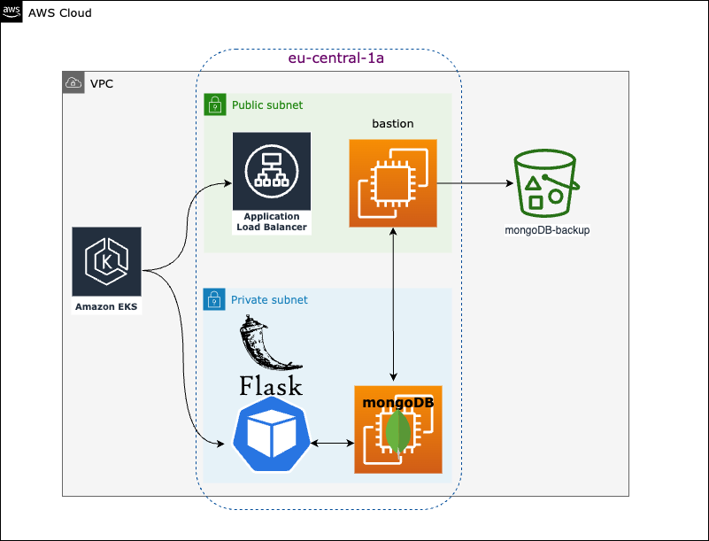

# About

VulnApp is a simple Flask application that's used to store a list of vulnerabilities that are present in itself.

The app runs on Amazon EKS with mongoDB on EC2 used as back-end. Database is being backed up to S3 every 5 minutes by a script running on the bastion host. 

# Project Diagram

# Project tree 
    .
    ├── ...
    ├── assets                             
    │   └── vulnapp.png                 # Project diagram 
    ├── flaskApp                        
    │   ├── Dockerfile                  # Dockerfile
    │   ├── app.py                      # Flask app code
    │   ├── requirements.txt            # Dependencies
    │   └── templates                   # Html files used in flaskApp
    |       └── home.html
    ├── helpers                         
    │   └── mongodb_backup.sh           # Script used to backup mongoDB to S3
    ├── k8s                             
    │   └── vulnapp-deployment.yaml     # Kubernetes manifest
    ├── terraform                       
    │   ├── 0_providers.tf              
    │   ├── 10_vpc.tf                   
    │   ├── 20_ec2.tf                   
    │   ├── 25_iam.tf                   
    │   ├── 30_eks.tf                   
    │   ├── 40_lb_controller.tf         # LB controller is deployed by using a Helm chart
    │   ├── 100_variables.tf            
    │   └── 101_outputs.tf              
    └── README.md
    

# Prerequisites
    Terraform
    AWS CLI
    kubectl

# Steps to deploy the application

## Setup required credentials 
Set credentials by either setting local variables:

    export AWS_ACCESS_KEY_ID="xxxxx"
    export AWS_SECRET_ACCESS_KEY="xxxxx"
    export AWS_SESSION_TOKEN="xxxxx"

Or store your credentials in  ~/.aws/credentials

    [123456789123_AdministratorAccess]
    aws_access_key_id=xxxxx
    aws_secret_access_key=xxxxx
    aws_session_token=xxxxx

## Deploy infrastructure using Terraform 

    cd terraform
    terraform init
    terraform plan
    terraform apply

## Build and push docker image to ECR repo

    cd flaskApp
    aws ecr get-login-password --region eu-central-1 | docker login --username AWS --password-stdin 123456789123.dkr.ecr.eu-central-1.amazonaws.com
    
    docker buildx build --platform linux/amd64 -t flask-app:latest .
    docker tag flask-app:latest 123456789123.dkr.ecr.eu-central-1.amazonaws.com/flask-app:latest
    docker push 123456789123.dkr.ecr.eu-central-1.amazonaws.com/flask-app:latest
    
    
## Update kubeconfig so that kubectl works locally
    aws eks --region eu-central-1 update-kubeconfig --name eks-cluster

## Deploy the app to the cluster
    cd k8s
    kubectl apply -f vulnapp-deployment.yaml 
    

## Monitor the deployment and access the app
    kubectl logs -f -n kube-system -l app.kubernetes.io/name=aws-load-balancer-controller
    kubectl get pods 
    kubectl logs <POD> 

## Get FQDN of the public ALB
    kubectl get ingress 

# Destroy everything
    kubectl delete -f vulnapp-deployment.yaml 
    cd ../terraform
    terraform destroy